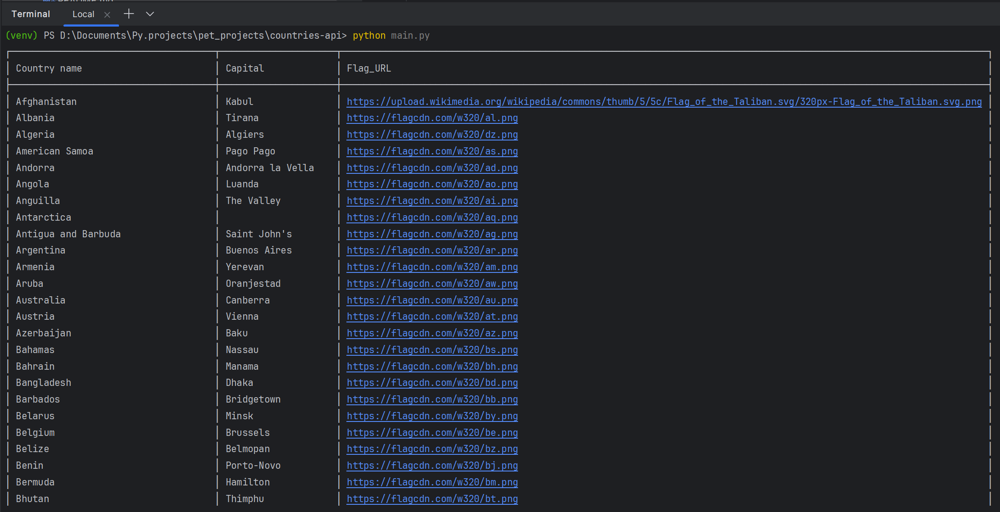

<h1 align="center">🌍 Countries API 🌍</h1>
<h3 align="center">Service for obtaining information about countries</h3>

## 📝 Description

The project is based on a class that interacts with the https://restcountries.com API.
The class receives data from the API and returns it to the console as a table.

* the name of the country
* the name of the capital
* link to flag image in png format

### ✅ Implemented checks

* Correctness of the entered data
* Connection error
* Timeout error
* The Request error

## 🛢️Technology stack

* Backend: Python 3.12.4, requests 2.32.3, prettytable 3.10.2
* Virtual Environment: venv
* Dependency Management: pip
* Collaboration and Version Control: Git, GitHub

## 🔀 Example response

Sorted by `Country name`


## 🚀 Install using GitHub

1. Install Python
1. Clone the repo
   ```commandline
   https://github.com/OleksiiKiva/countries-api.git   
   ```
1. Open the project folder in your IDE
1. Open the project terminal folder. Create & activate venv
   ```commandline
   python -m venv venv
   venv\Scripts\activate (on Windows)
   source venv/bin/activate (on Linux/MacOS)
   ```
1. Install all requirements
   ```commandline
   pip install -r requirements.txt
   ```
1. Run `main.py`
   ```commandline
   python main.py (on Windows)
   python3 main.py (on Linux/MacOS)
   ```

## 📧 Contacts

Please send bug reports and suggestions by email:
[oleksii.kiva@gmail.com](mailto:oleksii.kiva@gmail.com)
